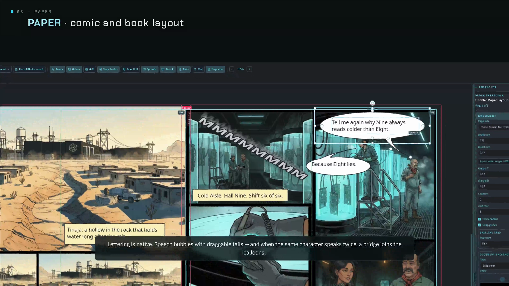
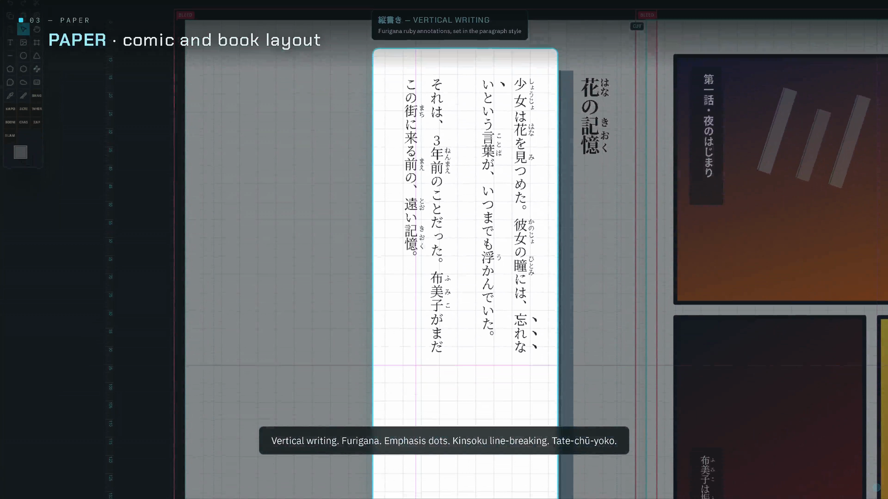
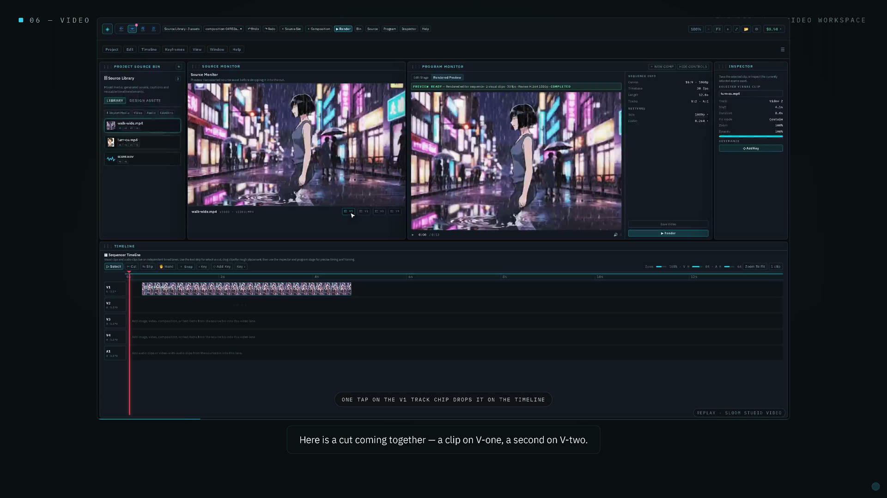

# Sloom Studio

### The creative suite you own. Free software.

[](https://buymeacoffee.com/es00bac)
[](https://github.com/Es00bac/sloom-studio/releases/latest)
[](LICENSE)

Sloom Studio (formerly Signal Loom) is a local-first creative suite: layered illustration,
comic and book layout, and video editing, all sharing one project file. No subscription, no
content account, and no content telemetry. Draw, letter, lay out, and export, in one app you own outright. A
node-based generation graph is in there too, for when you want it. It's entirely optional,
and you can build a whole project without ever opening it or adding a single API key.

> Repository documentation is verified against source version **0.9.16-b** (August 27, 2026).
> Public Android and desktop channels can carry separately labelled builds.

**[Download free](#download) &middot; [Watch the 17-minute tour](https://youtu.be/7-imCNPPXZM) &middot; [Who it's for](#who-its-for) &middot; [License](#license)**

## Screenshots

<p>
  
  
  
</p>

**Paper**, comic lettering: real speech bubbles with draggable tails, native to the layout
tool, no round-trip to a separate app. **Paper**, Japanese typesetting: genuine vertical
writing (tategaki) with furigana, not a translate-and-hope bolt-on. **Video**, the
multitrack timeline: source and program monitors, keyframes, and a real edit in progress,
not a slideshow tool bolted onto a paint app.

More screenshots, and the full 17-minute walkthrough of all four workspaces, painting to
print-ready: **[https://youtu.be/7-imCNPPXZM](https://youtu.be/7-imCNPPXZM)**

## What it is

Four workspaces, one `.sloom` project, one shared source library. Media moves between them
without re-importing.

- **Paper**: page-based publishing and print-ready layout for comics, books, and long-form
  documents. Comic bubbles (with same-speaker bridge), captions, panels, gutter knife, a
  Comic SFX Designer, threaded text with OpenType, hyphenation, drop caps, styles,
  find/change, hyperlinks, tables, Japanese vertical writing and furigana; long-document
  references/notes/variables/data merge/books/review; EPUB, bounded editable IDML import,
  ISBN/EAN-13, tagged Accessible PDF, and print-production PDF/X with CMYK and spot plates.
- **Image**: layer-based image editing and model-driven visual retouching. Full
  pressure/tilt/symmetry brush engine, high-bit RGB and bounded CMYK documents, Smart
  Objects/filters, PSD/XCF interchange, professional selection/transform/path/mask/
  adjustment/print/batch/photo/animation workflows, and fail-closed precision boundaries.
- **Video**: linked/managed ingest, multitrack sequencing, compositing, keyframes, audio and
  colour finishing, relink/transcript/multicam/broadcast/QC/tracking/keying workflows, and a
  durable render queue. Eligible one-video desktop jobs use direct native FFmpeg/VA-API;
  complex edits use the general compositor and native CPU remains a fallback.
- **Flow** (optional): a node-based generation and orchestration graph, for teams who want
  an AI-assisted pipeline into the other three workspaces. Bring your own provider keys;
  local nodes run without them. Undo/redo, validated partial-rerun caching, spend caps,
  starter recipes, local schedules, resumable batches, and credential-free node packs are
  built in.

The app runs in a normal browser through Vite, ships as an Electron desktop app with native
file dialogs and a KDE Plasma global menu, and ships as an Android/DeX app (Capacitor) with
file-manager intents, volume-key modifiers, an on-device LAN app server, and an on-device
upscaler.

> **Current product map:** [`docs/FEATURE_BREAKDOWN.md`](docs/FEATURE_BREAKDOWN.md).
> **Exact operation and limits for all 97 actionable qualified features:**
> [`docs/userguide/15-qualified-missing-hundred-features.md`](docs/userguide/15-qualified-missing-hundred-features.md).

## Who it's for

**Self-publishing comic and book creators, first.** If you draw, letter, lay out, and want
to end up with a print-ready or KDP-ready file, without stitching a paint app, a layout app,
and a print-prep tool together, this is built for exactly that. Paper's comic tooling
(bubbles, panels, gutter knife, SFX designer) and its print pipeline (PDF/X-4, PDF/X-1a,
CMYK and spot-color separations, IDML) live in one project alongside the art itself. If you
also want Japanese vertical typesetting and furigana, that's in the same tool, at no extra
step. This is the workspace almost nothing else at this price bundles.

**If you're primarily a painter, illustrator, or inker**, Image now covers a broad qualified
professional set, but the reason to choose Sloom remains the connected pipeline: edit the art,
letter it, lay it out, sequence it, and export it without moving between unrelated project models.
Every advanced route documents its supported subset instead of claiming universal interchange.

**AI-comfortable solo creators** who want an optional generate-to-print pipeline (Flow into
Paper) in one owned app, bringing your own provider keys, are a good secondary fit.

## Download

**[sloom.studio](https://sloom.studio)** has the current build for every platform. Windows and
Linux are stable; an experimental, unsigned macOS build also exists (Apple Silicon and
Intel; right-click, Open to pass Gatekeeper on first launch since it isn't notarized yet);
Android ships as a free app and through Samsung DeX.

**[GitHub Releases](https://github.com/Es00bac/sloom-studio/releases)** carries the same
prebuilt installers (`.exe`, `.AppImage`, `.deb`, `.dmg`, `.apk`) attached to each tagged
version, alongside the source at that tag.

**Everything is included.** Every download is the full app: all four workspaces, every export
including the professional print pipeline (PDF/X-4, PDF/X-1a, KDP-ready PDF, Adobe IDML, and
CMYK/spot-color separations), no watermarks, no account, no notices, no paid tier. There is
nothing to unlock.

**What is not here.** The physical-media brush engine used by [Hane](https://sloom.studio/hane/)
on Android, Tiltmark, is proprietary and is not part of this repository or these builds. The
Image workspace ships the built-in Studio brush engine. Buying Hane on Google Play is the way
to support this project financially.

## Feature summary

- **Paper**: professional page/comic/book composition, print/PDF-X/KDP, EPUB, IDML
  interchange, accessible PDF, and validated long-document/editorial systems.
- **Image**: layered raster/vector/type editing, natural-media brushes, native high-bit and
  CMYK subsets, interchange, non-destructive production tools, batch/photo workflows, and
  optional provider/local AI actions.
- **Video**: long-form-aware ingest and timeline editing, audio/colour/QC, professional
  handoff/caption/tracking/keying systems, and durable hardware/native/browser render routes.
- **Flow**: typed generation and local-processing graphs, capability-aware provider cards,
  cost/history controls, caching, automation, and portable graph/provider packs.
- Browser, Electron, and Android project workflows that save/reopen `.sloom` (plus
  `.slimg`/`.slppr`).
- Shared Source Library + per-project scratch so generated/imported assets are reused
  across all four apps.
- Optional local native FFmpeg render helper (desktop); optional remote preview gateway /
  Android LAN app server.
- API keys encrypted at rest (OS keychain on desktop, WebCrypto on web/Android).

## Providers

Flow (the optional generation graph) uses your own provider accounts and model access.
Provider keys are not included in this repository, and nothing in Flow runs or costs
anything until you add your own key.

Currently wired provider paths include:

- Text: Google Gemini, OpenAI-compatible chat, Hugging Face chat completion.
- Image: Google Gemini, OpenAI, Atlas Cloud, Hugging Face, Black Forest Labs, Stability AI,
  Local/Open models, and the Android Accelerator (on-device).
- Video: Google Veo (via Gemini long-running jobs and Atlas), Hugging Face text-to-video.
- Audio: Google Gemini, ElevenLabs, Hugging Face, speech, sound-effect, and voice-change
  modes.
- Desktop also bridges Google Vertex AI (Imagen/Gemini/Veo) via `gcloud` login or ADC/service
  account.

In browser mode, provider keys are entered in the app settings and stored in local browser
storage. In Electron mode, the renderer uses the same settings flow with native project/file
integration.

## Requirements

- Node.js 20 or newer.
- npm.
- Optional: Electron-capable desktop session for the native app.
- Optional: FFmpeg for local/native rendering paths.

## Build from source

Install dependencies:

```bash
npm install
```

Run the browser app:

```bash
npm run dev
```

Run the Electron app:

```bash
npm run electron
```

Run the Electron app against the Vite dev server:

```bash
npm run electron:dev
```

Build, test, and lint:

```bash
npm run build
npm run test
npm run lint
```

## Desktop Integration

The desktop launcher files live in `packaging/` and `scripts/`. The public launcher assumes
`signal-loom-electron` is installed somewhere on your `PATH`.

The systemd units under `ops/` are examples for local native rendering and optional remote
access. Copy the matching `.env.example` file, replace all placeholder values locally, and
do not commit the real environment file.

## Security Notes

- Never commit real provider API keys, tunnel tokens, SSH keys, project scratch
  directories, rendered output, or `.sloom` project files that contain private media
  references.
- `.env`, `.env.*`, scratch folders, generated output, Playwright state, and local notes are
  ignored by default.
- Remote access helpers are optional and must be configured with your own secrets outside
  the repository.

## Documentation

- Documentation map and current/historical status: `docs/README.md`
- User Guide: `docs/userguide/README.md`
- Complete bilingual manual source: `docs/user-manual-bilingual/`
- Generated public manual: `docs/release/website/sloom-studio/manual/`
- Current feature map: `docs/FEATURE_BREAKDOWN.md`
- Technical orientation: `docs/PROJECT_DOCUMENTATION.md`
- Exact qualified feature operation and boundaries: `docs/userguide/15-qualified-missing-hundred-features.md`
- Complete maturity reference: `docs/userguide/16-feature-maturity-reference.md`
- Technical orientation: `docs/PROJECT_DOCUMENTATION.md`

## Support the project

Sloom Studio is free software written by one person. It is funded by [Hane](https://sloom.studio/hane/),
our Android painting app (USD 9.99 one-time for Full), and by donations at
[sloom.studio/donate](https://sloom.studio/donate/). Hane's physical-media brush engine, Tiltmark, is
proprietary; a paid Tiltmark plugin for Sloom Studio's Image workspace is planned as a separate,
closed-source add-on. Sloom Studio does not depend on it and never will.

## License

Sloom Studio is free software: you can redistribute it and/or modify it under the terms of the
[GNU General Public License](LICENSE) as published by the Free Software Foundation, either
version 3 of the License, or (at your option) any later version. It is distributed in the hope
that it will be useful, but without any warranty; see the licence for details.

Contributions are accepted under the same licence with a Developer Certificate of Origin
sign-off and the short [Contributor License Agreement](CLA.md); see [CONTRIBUTING.md](CONTRIBUTING.md).

**"Sloom Studio", "Signal Loom", "Hane" and "Tiltmark" are trademarks of Sloom Software LLC.**
The licence covers copyright only; see [TRADEMARKS.md](TRADEMARKS.md) for what you may and may
not do with the names and logos.

Bundled third-party components and their licences are listed in
`shared/third-party-components.json` and `shared/third-party-notices/`. The bundled fonts are
under the SIL Open Font License or equivalent free licences.

