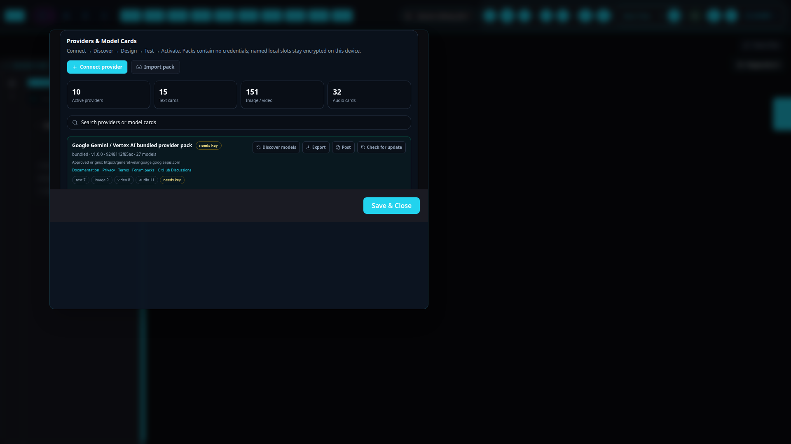
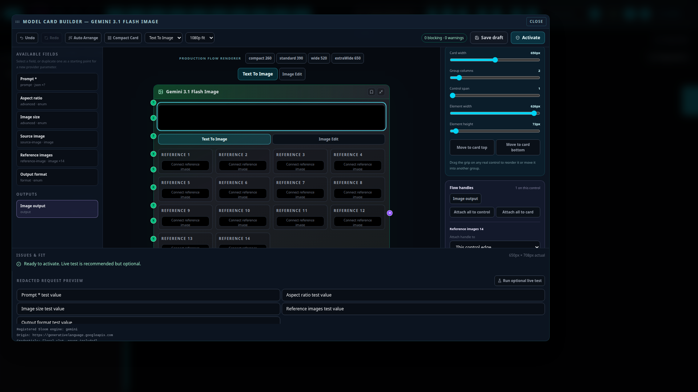
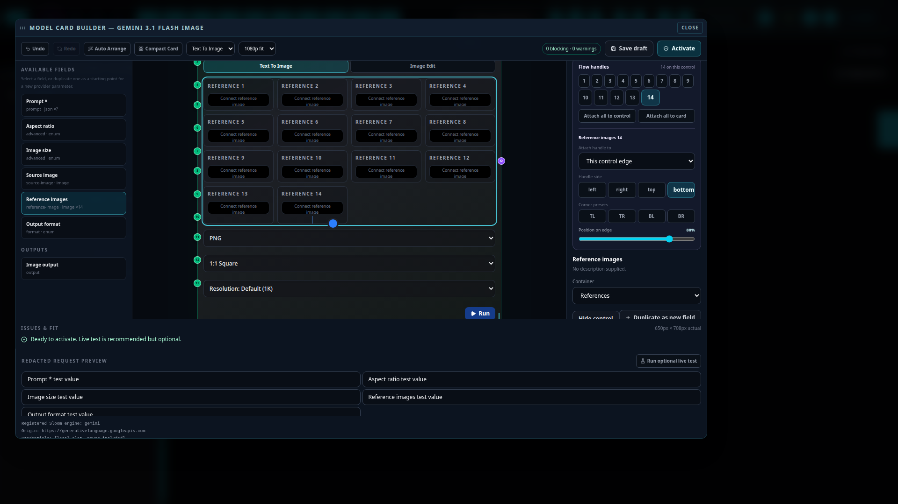
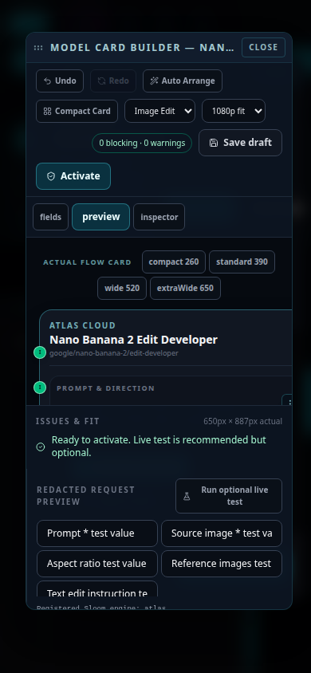
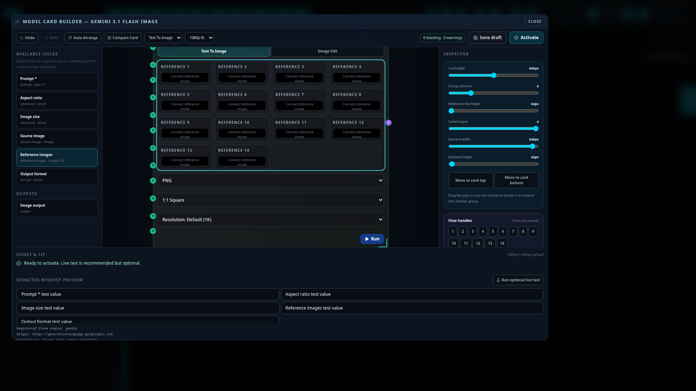
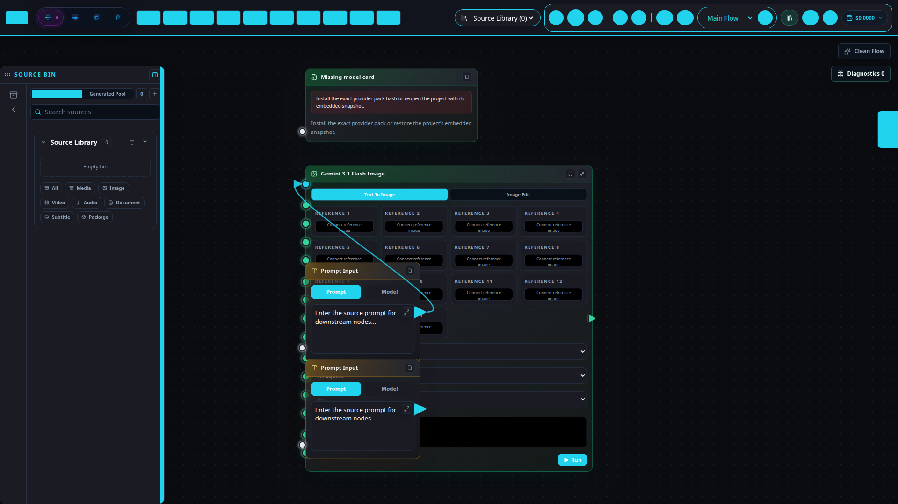

# 14. Provider packs & model cards

Provider packs let Sloom describe a provider and its models without provider-specific card code.
The bundled providers, including Atlas Cloud, use the same credential-free
`.sloom-provider.json` format that you can import, edit, and share.

The normal journey is:

```text
Connect  →  Discover  →  Design  →  Test  →  Activate
 endpoint    models       card      optional    use in Flow
 + local key + fields     layout    may cost
```

You never need to edit JSON to connect a schema-rich provider. Sloom builds the best card it can,
marks what it knows and what it inferred, and leaves incomplete work as an understandable draft.

## Open Providers & Model Cards

Use either route:

- Open **Settings → Providers → Providers & Model Cards**.
- In Flow, open the **Generate** group and choose **Connect or manage providers**.

The library shows where each pack came from, its exact approved destinations, model counts by
media type, active and bundled versions, and whether it is configured, untested, or in error.



## Connect and discover a provider

1. Select **Connect provider**.
2. Enter the API base endpoint.
3. Choose the authentication type and paste the key or token. The value becomes an encrypted,
   named local credential slot; it is not added to the pack.
4. Optionally name the provider or paste an OpenAPI/JSON Schema document, documentation URL, or
   sample cURL/JSON request.
5. Select **Discover models**.

Sloom tries, in order, the provider's Sloom manifest, advertised schemas, the supplied
OpenAPI/JSON Schema, a known profile, `/v1/models`, `/models`, the sample request, and finally a
manual draft.

Discovery badges tell you the strength of the evidence:

| Badge | Meaning |
|---|---|
| **Provider verified** | The provider supplied a Sloom manifest or equivalent authoritative metadata. |
| **Sloom recognized** | A built-in provider profile matched. |
| **Inferred—please check** | Sloom inferred controls from schema or a model ID. |
| **Manual** | The card needs author choices. |
| **Untested** | No live result has confirmed the operation. |

Credentials are sent only to the exact origin you approved. A schema advertised on another
origin is fetched without your credentials.

## Design the model card

Open the provider, use its model search when needed, and click the model card you want to edit.
This works for cards that already exist, including bundled Atlas, Gemini, OpenAI, and other shipped
cards. The center of the builder is the actual selected Flow card—not a diagram, approximation, or
second implementation of its layout. The builder and activated Flow node call the same production
renderer. Text boxes, media wells, dropdowns, galleries, sections, output panel, and numbered Flow
handles therefore look and behave the same in both places.

Bundled recovery copies remain immutable. Editing one creates an editable local draft/override,
so **Restore bundled version** can always recover the shipped card. Saving presentation changes
does not change the provider endpoint or request bindings.

The real card is surrounded by:

```text
┌ Available fields ┬──── Flow card preview ────┬ Inspector ┐
│ fields + outputs │ drag, resize, align, grid │ plain UI  │
│ and field roles  │ tabs, galleries, sections│ Advanced  │
├──────────────────┴────────────────────────────┴────────────┤
│ Issues and fit                     Redacted request / Test │
└────────────────────────────────────────────────────────────┘
```

On a narrow display, these become **Fields**, **Preview**, and **Inspector** tabs.



Useful actions:

- **Undo**, **Redo**, **Auto Arrange**, and **Compact Card**.
- Click a real control in the card to inspect it.
- Drag the dotted grip on a control to reorder it or move it into another group.
- Select any field or output and use **Element width** and **Element height** for exact sizing.
- Drag **Image output** like any other element, or use **Move to card top** / **Move to card
  bottom**. Moving it to the top places the real output well directly below the card header.
- In a freeform group, drag the selected control directly. Arrow keys move it precisely; hold
  Shift for larger steps.
- Drag the right edge of the card, use a width preset, or move the **Card width** slider.
- Choose any value from 1–14 with the **Group columns** slider. The 1–4 buttons are convenient
  common presets, not a limit.
- Make repeated media wells shorter or taller with **Reference tile height**.
- Change how much of a structured row a control occupies with **Control span**.
- Change a group to freeform, grid, reference gallery, collapsible, tabs, inline row, or pinned
  media.
- Duplicate a field as a safe starting point for another provider parameter.
- Move optional controls into the collapsed **Advanced — optional** section.
- Switch operations and preview 1080p, 1440p, or 4K fit.

The Advanced section is always present in the inspector. It shows request paths, encodings,
semantic roles, transport routes, polling details, and output extraction without making those
details the first thing a creative user must understand.

### Position Flow handles

Click a numbered handle marker on the card, or select its number under **Flow handles** in the
inspector. For every input and output you can choose:

- **Main card edge** or **This control edge**;
- left, right, top, or bottom side; and
- an exact 0–100 percent position along that edge.

The **TL**, **TR**, **BL**, and **BR** presets put a handle directly on a corner. The position
slider then lets you put it anywhere else—for example, 25 percent down the left edge or 80 percent
across the bottom edge.

**Attach all to control** places all slots of a repeated field—such as all 14 reference-image
ports—on that gallery. **Attach all to card** moves them back to the main node edge. Handle
placement is presentation-only; it cannot change what request field or output a port represents.



On phones and small tablets, the same builder keeps its full toolset in responsive
**Fields**, **Preview**, and **Inspector** tabs:



## Make reference-heavy cards shorter

Card widths can be dragged from 260–1040 px or selected from:

| Preset | Width |
|---|---:|
| Compact | 260 px |
| Standard | 390 px |
| Wide | 520 px |
| Extra Wide | 650 px |

A reference gallery uses the exact maximum supported by the model. Fourteen references can be
shown as fourteen one-column rows, seven two-column rows, five three-column rows, four four-column
rows, one fourteen-column row, or anything between. For a 14-reference Gemini or Atlas card:

1. Select **Reference images** in the real card.
2. Set **Card width** to **650 px** or wider.
3. Set **Group columns** to **3** or **4** for comfortable thumbnails, or as high as **14** when
   compactness matters more than thumbnail width.
4. If needed, reduce **Reference tile height** while keeping the media wells comfortable to hit.



Sloom continuously reports the card's measured production-renderer height and suggests width,
column, Advanced, or Auto Arrange repairs. It does not put a full-card scrollbar inside the Flow
canvas.

## Adaptive operations

One model has one card. If it supports **Generate**, **Edit**, and **Inpaint**, switch operations
from the fixed selector at the top of the card. Each operation can have its own visible fields,
required ports, route, and result.

When you change operation, compatible wires move by semantic role and slot number. Incompatible
wires remain visible as **Needs remapping** stubs; Sloom never silently deletes them.

A wire is drawn above the two cards it connects, so a line crossing a wide card remains visible all
the way to its exact landing handle. Cards it is *not* connected to cover it instead, which keeps a
dense graph readable. The live wire being dragged always stays on top.



## Save, test, and activate

- **Save draft** always works, even when the card is incomplete.
- Blocking issues select the affected control and, when safe, offer a one-click repair.
- **Run optional live test** sends the redacted previewed request. It is recommended but may cost
  money, so it is never required.
- **Activate** is blocked until request fields, routing, outputs, ports, and card geometry are
  structurally safe. A valid card can be activated as **Ready—untested**.

Untested active cards retain a visible badge in Flow.

## Resize a card in Flow

Select an adaptive model card and drag its edge handle. This changes only that node. The card menu
also offers:

- apply this layout to every card of the model in the current Flow;
- save it as your personal default on this device;
- reset this node;
- reset to the pack layout; or
- promote the layout to a new editable pack draft.

Node layout wins over your personal default, which wins over the pack default. Personal and node
overrides contain presentation only; they cannot alter an endpoint, credential, field binding, or
execution route.

## Import, export, update, and recover

- **Import pack** accepts a bounded `.sloom-provider.json` file and opens a difference review.
  Review endpoint, model, capability, transport, layout, credential-slot, and trust changes before
  approving exact origins.
- **Export** writes a credential-free pack and its SHA-256.
- **Community post** creates credential-free Markdown with versions, models, disclosed endpoints,
  source documents, test date, screenshot placeholders, and safety notes.
- **Restore bundled version** returns to Sloom's immutable recovery copy.
- **Remove override** removes only the selected imported version.

Existing Flow nodes remain pinned to the exact approved pack hash. A newer active version does not
silently change their execution.

## Move a project to another device

Projects embed credential-free snapshots of only the cards they use. On another device those cards
can render, but they cannot execute until the exact origins are approved and the required local
credential slots are filled. Personal layout preferences are device preferences unless you
deliberately promote one into a pack version.

## Safe sharing checklist

Before posting a pack:

1. Export it from Sloom; do not hand-add a key.
2. Disclose every endpoint.
3. Link the provider's documentation, privacy policy, and terms.
4. State which operations were tested and when.
5. Add screenshots and data-handling notes.
6. Compare the published SHA-256 with Sloom's export result.

See the [technical provider-pack author reference](../provider-pack-author-reference.md) for the
complete contract and [provider-pack security & privacy](../provider-pack-security-and-privacy.md)
for the trust boundary.

---

Previous: [Keyboard & stylus](11-keyboard-and-stylus.md)
